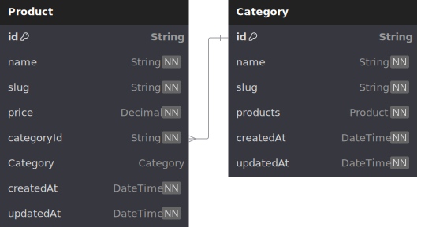

# Chez Syarif

## Links

- Website/Frontend: https://chez.syarifhasibuan.com/
- Backend: https://chez-api.syarifhasibuan.com/
- Repositories:
  - General: https://github.com/chez-syarif
  - Frontend: https://github.com/chez-syarif-frontend

Inspiration:

- https://www.paul.fr/
- https://www.paul-indonesia.co.id/

## Features

- Home page
  - Hero section
  - Selections
- Products page
  - Pastries
  - Sandwiches
  - Breads
  - Beverages
- Authentication
  - Login
  - Sign-up
- Checkout page

## Product Categories

- Breads
- Pastries
- Mini-Pastries
- Beverages
- Sandwiches

## UI Design

## Entity Relationship Diagram (ERD)

## REST API Endpoints

Products:

| Method | Path     | Description           | Status         |
| ------ | -------- | --------------------- | -------------- |
| GET    | `/`      | Get all products      | 200: `[]`      |
| GET    | `/:slug` | Get a product by slug | 200: `{}`, 404 |

Categories:

| Method | Path | Description        | Status    |
| ------ | ---- | ------------------ | --------- |
| GET    | `/`  | Get all categories | 200: `[]` |

| GET | `/:slug` | Get a category by slug | 200: `{}`, 404 |
