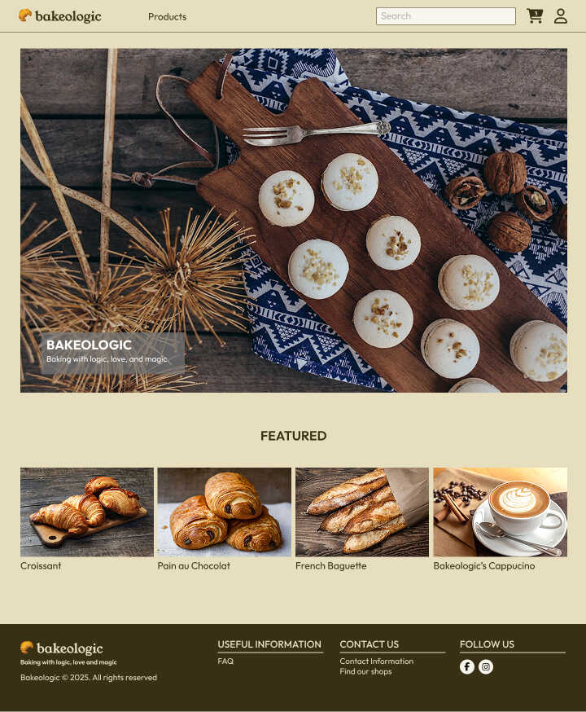

# Bakeologic

## Links

- Frontend Web: https://bakeologic.syarifhasibuan.com
- Backend API: https://bakeologic-api.syarifhasibuan.com
- Figma: https://figma.com/design/dD5LKpOrQkhrb2q8Wsf7Yl/Bakeologic

Repositories:

- General: https://github.com/syarifhasibuan/bakeologic
- Frontend Web: https://github.com/syarifhasibuan/bakeologic-web
- Backend API: https://github.com/syarifhasibuan/bakeologic-api

Inspirations:

- https://paul.fr
- https://paul-indonesia.co.id
- https://la-petitemarquise.fr/

## Features

- Home
  - Hero
  - Featured Selections
- Products List
  - Product Item
    - Images
    - Name
    - Price
    - SKU
    - Add to Cart
    - Description
    - Stock Quantity
- Product Categories
  - Breads
  - Pastries
  - Mini-Pastries
  - Beverages
  - Sandwiches
- Authentication/Authorization
  - Sign Up
  - Log In
  - Log Out
- Shopping Cart
- Checkout
  - Shipping Address

## UI Design

### Home page

## Entity Relationship Diagram (ERD)

## REST API Endpoints

Products: `/products`

| Method | Path     | Description           | Status         |
| ------ | -------- | --------------------- | -------------- |
| GET    | `/`      | Get all products      | 200: `[]`      |
| GET    | `/:slug` | Get a product by slug | 200: `{}`, 404 |
| POST   | `/`      | Create a product      | 201: `{}`      |

Categories: `/categories`

| Method | Path     | Description            | Status         |
| ------ | -------- | ---------------------- | -------------- |
| GET    | `/`      | Get all categories     | 200: `[]`      |
| GET    | `/:slug` | Get a category by slug | 200: `{}`, 404 |
